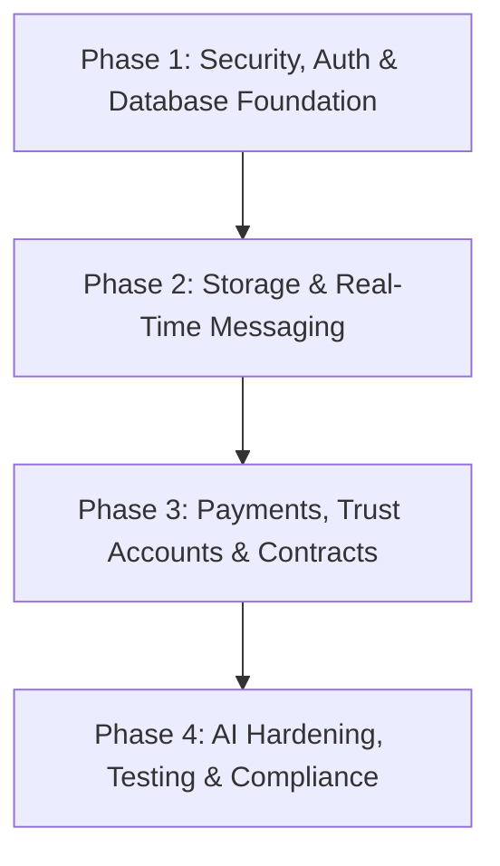

# Advocato Legal Marketplace: Comprehensive Production-Grade Readiness Audit

This audit evaluates the Advocato codebase against enterprise production standards for legal technology platforms. It examines architectural integrity, data durability, security boundaries, regulatory compliance, real-time infrastructure, operational observability, and front-end engineering.

---

## 1. Executive Summary & Readiness Score

Advocato features an exceptionally refined typographic and editorial design system alongside a functioning LLM intake classification route in [app/api/match/route.ts](file:///c:/Users/Unleashed/Desktop/Work/Alrawi/Legal%20app/app/api/match/route.ts). However, the application currently functions as a **state-simulated client-side prototype**. All core business operations—identity management, matter dockets, privileged client-lawyer communications, document uploads, and attorney registration—rely on ephemeral browser memory and `localStorage`.

### Overall Production Readiness: 22 / 100

| Domain | Readiness | Primary Blocker |
| :--- | :--- | :--- |
| **Data Persistence & Model Integrity** | 10% | Zero server-side database; all data resides in client `localStorage` |
| **Auth & Access Control (RBAC)** | 5% | Zero authentication; unrestricted client/lawyer role switching |
| **Evidentiary File Storage & Security** | 5% | Uploads are simulated in-memory; no cloud object storage or encryption |
| **Real-Time Communications** | 15% | Chat uses `setTimeout` mocks; WebSockets/WebRTC are non-existent |
| **API Architecture & Rate Limiting** | 35% | No schema validation (Zod), no rate limiting, unmetered LLM egress |
| **Billing, Retainers & Trust Accounting** | 0% | No payment provider, IOLTA escrow, or engagement letter generation |
| **Legal Compliance & Ethical Safeguards** | 20% | No UPL disclaimers, Terms of Service, or privilege waivers |
| **Observability, Health & Error Tracking** | 5% | No Sentry, structured logging, or uptime health endpoints |
| **Testing, Quality Assurance & CI/CD** | 0% | Zero automated tests (unit, integration, E2E), no CI pipelines |
| **Front-End Polish, Performance & a11y** | 70% | Unoptimized raw `` tags, hydration flash risks, minor a11y gaps |

---

## 2. Data Persistence & Relational Schema Layer

### Current Implementation Deficiencies
In [lib/data/lawyers.ts](file:///c:/Users/Unleashed/Desktop/Work/Alrawi/Legal%20app/lib/data/lawyers.ts) and [lib/data/consultations.ts](file:///c:/Users/Unleashed/Desktop/Work/Alrawi/Legal%20app/lib/data/consultations.ts), all dynamic mutations are written to browser storage via `LAWYER_STORAGE_KEY` and `CONSULTATION_STORAGE_KEY`. Newly registered attorneys in [registerNewLawyer](file:///c:/Users/Unleashed/Desktop/Work/Alrawi/Legal%20app/lib/data/lawyers.ts#L137-L196) are stored in `inMemoryCustomLawyers` and client `localStorage`.

1. **Cross-Device & Cross-Session Data Isolation:** A client submitting an intake on mobile cannot view their matter on desktop. Clearing browser cache permanently erases all case records and messages.
2. **Lack of Concurrency & Data Integrity:** Two simultaneous messages or intake updates will overwrite each other due to unversioned JSON blobs in browser storage.
3. **No Database Transactions:** Critical workflows (such as creating an intake assessment, matching counsel, and opening a matter vault) must execute within an ACID-compliant transaction boundary.

### Production Requirements
A relational database (PostgreSQL via Neon, Supabase, AWS RDS, or Cloud SQL) managed by an ORM/query builder (Drizzle or Prisma) is required. The normalized schema must establish:

```
users (id, email, role, created_at)
  ├── client_profiles (user_id, full_name, phone)
  └── lawyer_profiles (user_id, bar_number, state_bar, verified_at, hourly_rate_cents, bio)
        └── lawyer_practice_areas (lawyer_id, practice_area_id)

matters (id, client_id, lawyer_id, case_title, status, urgency, jurisdiction, created_at)
  ├── matter_intakes (matter_id, raw_narrative, ai_summary, key_facts, match_score)
  ├── matter_documents (id, matter_id, uploader_id, file_path, file_hash_sha256, is_privileged)
  └── matter_messages (id, matter_id, sender_id, message_type, content, attachment_id, created_at)
```

---

## 3. Identity Verification, Multi-Tenancy & Legal Privilege Boundaries

### Current Implementation Deficiencies
In [lib/context/RoleContext.tsx](file:///c:/Users/Unleashed/Desktop/Work/Alrawi/Legal%20app/lib/context/RoleContext.tsx), role management is executed client-side through [useUserRole](file:///c:/Users/Unleashed/Desktop/Work/Alrawi/Legal%20app/lib/context/RoleContext.tsx#L118-L124). Tapping the "Switch to Lawyer" button in [components/navigation/BottomNav.tsx](file:///c:/Users/Unleashed/Desktop/Work/Alrawi/Legal%20app/components/navigation/BottomNav.tsx#L80-L87) or [components/navigation/Header.tsx](file:///c:/Users/Unleashed/Desktop/Work/Alrawi/Legal%20app/components/navigation/Header.tsx#L141-L151) immediately switches the active identity to Elena Rostova or any newly registered attorney without authentication.

1. **Catastrophic Confidentiality Vulnerability:** Under ABA Model Rule 1.6 (Confidentiality of Information) and state bar equivalents, attorney-client privileged communications and matter details must never be accessible to unverified third parties. Any user visiting `/cases` or `/messages` can inspect sensitive client matter filings.
2. **Absence of Authentication Sessions:** No JWTs, cryptographic session cookies, OAuth providers, or magic link sign-in flows exist.
3. **Missing Route Guard Middleware:** No `middleware.ts` exists in the Next.js root. All application routes (`/cases`, `/messages`, `/profile`, `/consultation/[id]`) are publicly exposed without session validation.

### Production Requirements
1. **Authentication Infrastructure:** Deploy Auth.js / NextAuth, Clerk, or Supabase Auth with passwordless magic links or multi-factor authentication (MFA) mandatory for licensed attorneys.
2. **Server-Side Session Verification:** Implement an edge `middleware.ts` verifying session tokens and redirecting unauthenticated requests to a secure `/login` portal.
3. **Row-Level Security & Privilege Verification:** Enforce database row-level security (RLS) ensuring `SELECT` and `INSERT` queries on `matters` and `matter_messages` only succeed if `auth.uid() = client_id` or `auth.uid() = lawyer_id`.

---

## 4. Evidentiary Document Storage & Custody Chain

### Current Implementation Deficiencies
In [app/intake/page.tsx](file:///c:/Users/Unleashed/Desktop/Work/Alrawi/Legal%20app/app/intake/page.tsx#L89-L135), the file selector extracts file metadata (`name`, `size`) and generates a simulated [UploadedFileItem](file:///c:/Users/Unleashed/Desktop/Work/Alrawi/Legal%20app/app/intake/page.tsx#L22-L27). In [app/messages/page.tsx](file:///c:/Users/Unleashed/Desktop/Work/Alrawi/Legal%20app/app/messages/page.tsx), attachments are hardcoded objects referencing placeholder filenames.

1. **No Binary Uploads:** Actual file payloads are never transmitted to an object storage bucket; files cannot be reviewed or downloaded by the receiving lawyer.
2. **Missing Encryption at Rest:** Legal documents containing non-disclosure agreements, trade secrets, and termination letters require dedicated AES-256 or AWS KMS encryption.
3. **No Antivirus or Malware Scanning:** Direct client uploads without automated scanning (e.g., ClamAV, AWS GuardDuty) expose attorney recipients to malicious file executions.
4. **Public Exposure Vulnerability:** Documents must not reside in public storage or static CDN paths without expiring, signed authorization URLs.

### Production Requirements
1. **Private Bucket Storage:** Configure AWS S3, Cloudflare R2, or Supabase Storage with public access completely blocked.
2. **Presigned Upload & Download URLs:** Client generates a presigned `PUT` request with short expiration (15 minutes). File downloads must require authenticated, temporary presigned `GET` tokens.
3. **Cryptographic Hashing:** Calculate SHA-256 file hashes on upload for chain-of-custody verification.

---

## 5. Real-Time Communications & Telehealth/Video Infrastructure

### Current Implementation Deficiencies
In [app/messages/page.tsx](file:///c:/Users/Unleashed/Desktop/Work/Alrawi/Legal%20app/app/messages/page.tsx#L208-L224), when a client submits a message via [handleSendMessage](file:///c:/Users/Unleashed/Desktop/Work/Alrawi/Legal%20app/app/messages/page.tsx#L174-L235), attorney responses are simulated using browser `setTimeout` calls.

1. **Lack of Socket/Duplex Connection:** No WebSockets, Server-Sent Events (SSE), or WebRTC channels exist. Two separate browser instances cannot communicate in real time.
2. **Simulated Voice Recordings:** The audio voice note feature in [app/messages/page.tsx](file:///c:/Users/Unleashed/Desktop/Work/Alrawi/Legal%20app/app/messages/page.tsx#L129-L157) utilizes an artificial `setInterval` counter rather than capturing audio streams via the browser `navigator.mediaDevices.getUserMedia()` and `MediaRecorder` APIs.
3. **Mock Video Consultation:** The video consultation modal is a static layout with mock action buttons; no WebRTC signaling server, media server, or session token generation is wired.

### Production Requirements
1. **Real-Time Transport:** Implement Supabase Realtime, Pusher, or Ably for sub-100ms message delivery, typing indicators, and read receipt updates.
2. **Audio Capture Pipeline:** Utilize the Web Audio API to record Opus audio blobs, upload via presigned URLs to cloud storage, and serve via standard HTML5 audio elements.
3. **Privileged Video Rooms:** Integrate LiveKit, Daily.co, or Twilio Video with tokenized authentication and end-to-end encryption for scheduled consultations.

---

## 6. AI Intake Pipeline, Prompt Security & API Resilience

### Current Implementation Deficiencies
In [app/api/match/route.ts](file:///c:/Users/Unleashed/Desktop/Work/Alrawi/Legal%20app/app/api/match/route.ts):

1. **Unrestricted Rate Limiting & Denial of Service:** The `POST /api/match` endpoint has no IP or user rate limiting. Malicious actors or crawlers can flood the endpoint, exhausting OpenRouter API credits.
2. **Missing Schema Validation:** Request payloads are cast directly via `const body: RequestBody = await req.json()`. Missing fields or malicious payloads will trigger runtime unhandled rejections.
3. **Direct Prompt Injection Exposure:** In lines 83-84:
   ```typescript
   Client Situation Narrative:
   "${effectiveText}"
   ```
   Client narrative text is directly interpolated into the LLM user prompt without sanitization, delimiter tagging, or XML tag isolation, allowing adversarial prompt injections to override triage instructions.
4. **Information Leakage in Error Responses:** Line 184:
   ```typescript
   return NextResponse.json(
     { error: "Failed to process case matching", details: error?.message },
     { status: 500 }
   );
   ```
   Directly returning `error?.message` risks exposing internal network traces or upstream OpenRouter provider details to clients.
5. **No Token Usage Metering:** AI inference costs are untracked per user or matter.

### Production Requirements
1. **Rate Limiting:** Deploy `@upstash/ratelimit` or Redis sliding-window limiters (e.g., 5 requests per minute per IP/user).
2. **Strict Schema Validation:** Enforce Zod input validation on all request bodies:
   ```typescript
   import { z } from "zod";

   const MatchRequestSchema = z.object({
     caseTitle: z.string().max(120).optional(),
     category: z.string().max(80).optional(),
     jurisdiction: z.string().max(50).optional(),
     urgency: z.enum(["High", "Medium", "Low"]).default("Medium"),
     situation: z.string().min(10).max(4000),
   });
   ```
3. **Prompt Hardening:** Encapsulate user inputs in delimited blocks (e.g., `<user_narrative>...</user_narrative>`) with explicit system instructions to ignore instructions inside user tags.
4. **Sanitized Error Handling:** Return generic customer error messages with internal incident IDs logged to an APM tool.

---

## 7. Billing, Retainers & IOLTA Trust Accounting Compliance

### Current Implementation Deficiencies
While lawyers advertise hourly rates ($295 to $420/hr in [lib/data/lawyers.ts](file:///c:/Users/Unleashed/Desktop/Work/Alrawi/Legal%20app/lib/data/lawyers.ts)), there is zero financial infrastructure. Consultation booking buttons simply redirect to messages without payment or authorization.

1. **No Payment Gateway:** No integration with Stripe, LawPay, or LemonSqueezy.
2. **Bar Trust Accounting (IOLTA) Rules:** In legal fee billing, unearned retainer funds must be placed into an Interest on Lawyers' Trust Account (IOLTA) until billed hours are accrued. Standard consumer payment setups that dump funds directly into operating accounts violate state bar disciplinary rules.
3. **No Retainer Agreement Execution:** A client cannot legally engage counsel without an executed engagement letter. The application lacks e-signature integration (e.g., DocuSign, Dropbox Sign API).

### Production Requirements
1. **Stripe Connect / LawPay Integration:** Implement split payments allowing clients to pay consultation fees and retainer deposits with separation between platform commission and attorney funds.
2. **Automated Engagement Letter Flow:** Generate dynamic engagement agreements upon booking, requiring digital signature verification before consultation chat rooms unlock.

---

## 8. Security Hardening & HTTP Response Headers

### Current Implementation Deficiencies
In [next.config.ts](file:///c:/Users/Unleashed/Desktop/Work/Alrawi/Legal%20app/next.config.ts):
```typescript
const nextConfig: NextConfig = {
  reactStrictMode: true,
  devIndicators: false,
  images: {
    remotePatterns: [...],
  },
};
```

1. **Missing Content Security Policy (CSP):** The app does not declare CSP headers. Vulnerable to Cross-Site Scripting (XSS) and unauthorized script injection.
2. **Missing Anti-Clickjacking & MIME Protection:** Headers such as `X-Frame-Options: DENY`, `X-Content-Type-Options: nosniff`, and `Referrer-Policy: strict-origin-when-cross-origin` are absent.
3. **Missing Strict-Transport-Security (HSTS):** No HSTS enforcement ensures traffic remains exclusively on TLS/HTTPS.
4. **CORS Configuration:** API routes lack configured CORS policies.

### Production Requirements
Update [next.config.ts](file:///c:/Users/Unleashed/Desktop/Work/Alrawi/Legal%20app/next.config.ts) with standard defense headers:
```typescript
const securityHeaders = [
  { key: "X-DNS-Prefetch-Control", value: "on" },
  { key: "Strict-Transport-Security", value: "max-age=63072000; includeSubDomains; preload" },
  { key: "X-Frame-Options", value: "DENY" },
  { key: "X-Content-Type-Options", value: "nosniff" },
  { key: "Referrer-Policy", value: "strict-origin-when-cross-origin" },
  { key: "Permissions-Policy", value: "camera=(), microphone=(self), geolocation=()" },
];
```

---

## 9. Observability, Logging, Error Tracking & Health Monitoring

### Current Implementation Deficiencies
1. **Unmonitored Client Errors:** Runtime exceptions occurring in client browsers are silently lost. There is no Sentry, Datadog, or LogRocket integration.
2. **Unstructured Server Logging:** Errors in [app/api/match/route.ts](file:///c:/Users/Unleashed/Desktop/Work/Alrawi/Legal%20app/app/api/match/route.ts#L164-L182) use raw `console.warn` and `console.error`. Logs lack correlation IDs, request context, and structured JSON formatting.
3. **No Healthcheck Route:** Cloud orchestrators (Kubernetes, AWS ECS, Fly.io) and uptime pingers (BetterStack, Pingdom) cannot query an `/api/health` or `/api/ready` endpoint.

### Production Requirements
1. **Sentry Error Tracking:** Install `@sentry/nextjs` to capture unhandled client and edge runtime rejections.
2. **Structured Logging:** Implement Pino or Winston emitting JSON logs with matter IDs and trace IDs.
3. **Uptime Health Route:** Add `app/api/health/route.ts` checking database connectivity and external LLM provider reachability.

---

## 10. Automated Testing, CI/CD & Code Quality

### Current Implementation Deficiencies
In [package.json](file:///c:/Users/Unleashed/Desktop/Work/Alrawi/Legal%20app/package.json), the scripts block contains only:
```json
"scripts": {
  "dev": "next dev",
  "build": "next build",
  "start": "next start"
}
```

1. **Zero Test Coverage:** No unit tests (Vitest/Jest), no component tests (React Testing Library), and no end-to-end tests (Playwright/Cypress).
2. **Critical Uncovered Logic:** [lib/intake/analyzer.ts](file:///c:/Users/Unleashed/Desktop/Work/Alrawi/Legal%20app/lib/intake/analyzer.ts), [app/api/match/route.ts](file:///c:/Users/Unleashed/Desktop/Work/Alrawi/Legal%20app/app/api/match/route.ts), and lawyer scoring logic have zero regression verification.
3. **No Lint / Format Script:** ESLint and Prettier are not configured in `package.json` scripts.
4. **No Continuous Integration (CI):** No GitHub Actions or GitLab CI configuration exists to run typechecks or builds automatically before merging pull requests.

### Production Requirements
1. **Test Stack:** Install Vitest for unit testing and Playwright for end-to-end verification of intake and messaging flows.
2. **CI Pipeline:** Create `.github/workflows/ci.yml` running linting, TypeScript compiler checks (`tsc --noEmit`), and automated test suites on every push.

---

## 11. Legal Ethics, Regulatory Compliance & Legal Boilerplate

### Current Implementation Deficiencies
1. **Unauthorized Practice of Law (UPL) Risks:** When an AI engine evaluates a client's narrative, extracts key facts, and suggests categories, legal regulatory bodies (such as the NY State Bar and State Bar of California) can classify this as rendering unauthorized legal advice if appropriate disclaimers are omitted.
2. **Missing Legal Documentation:** The application currently contains no:
   - Terms of Service
   - Privacy Policy (GDPR / CCPA / CalOPPA compliant)
   - Pre-Engagement Disclaimer ("Use of Advocato does not create an attorney-client relationship until a formal engagement agreement is executed with admitted counsel")
   - Attorney Referral Fee Disclaimers (complying with ABA Model Rule 5.4 / 7.2)
3. **Data Subject Rights:** No mechanism exists for clients to request full export or deletion of their submitted legal narratives and documents.

### Production Requirements
1. **Mandatory Disclaimer Banners:** Prominently display explicit disclaimers on intake forms and chat headers clarifying that preliminary AI assessments are informational triage, not formal legal opinions.
2. **Privacy & Policy Modals:** Integrate legally vetted Terms of Service and Privacy Policy pages.
3. **Audit Log Trail:** Maintain tamper-proof database audit records tracking every access to client case records for compliance and subpoena discovery readiness.

---

## 12. Front-End Performance, Hydration & Accessibility

### Current Implementation Deficiencies
1. **Unoptimized Images:** Multiple views—including [app/lawyers/[id]/page.tsx](file:///c:/Users/Unleashed/Desktop/Work/Alrawi/Legal%20app/app/lawyers/%5Bid%5D/page.tsx#L48-L52), [app/cases/page.tsx](file:///c:/Users/Unleashed/Desktop/Work/Alrawi/Legal%20app/app/cases/page.tsx#L56-L60), and [app/page.tsx](file:///c:/Users/Unleashed/Desktop/Work/Alrawi/Legal%20app/app/page.tsx#L208-L212)—use standard HTML `` elements rather than Next.js `<Image />`, causing uncompressed image downloads, layout shifts (CLS), and missing modern WebP/AVIF conversions.
2. **Client-Side Hydration Flash:** Reading `localStorage` inside `useEffect` in [RoleContext.tsx](file:///c:/Users/Unleashed/Desktop/Work/Alrawi/Legal%20app/lib/context/RoleContext.tsx#L32-L60) causes component re-rendering and layout flicker on initial page load.
3. **Accessibility (WCAG 2.1 AA) Issues:** Custom modals in [app/messages/page.tsx](file:///c:/Users/Unleashed/Desktop/Work/Alrawi/Legal%20app/app/messages/page.tsx) lack keyboard focus trapping (`focus-trap`), `aria-modal="true"`, and escape-key dismissal listeners.

### Production Requirements
1. Migrate all `` instances to `next/image` with explicit dimensions and optimization flags.
2. Introduce skeleton states for client components dependent on persistent storage.
3. Implement Radix UI or Headless UI primitives for accessible, fully keyboard-navigable dialogs, tooltips, and select menus.

---

## 13. Prioritized Implementation Roadmap



### Phase 1: Security, Auth & Database Foundation (Week 1–3)
- Deploy PostgreSQL database with Prisma/Drizzle schema.
- Implement server-side authentication (Auth.js/Clerk) with role-based claims.
- Add Next.js `middleware.ts` to protect `/cases`, `/messages`, and `/profile`.
- Remove client-side role toggling; bind sessions to real authenticated accounts.

### Phase 2: Storage & Real-Time Messaging (Week 4–6)
- Connect AWS S3 / Cloudflare R2 with presigned upload URLs and KMS encryption.
- Replace `setTimeout` chat simulation with WebSockets / Supabase Realtime.
- Implement audio voice note recording using browser `MediaRecorder` API.
- Wire WebRTC / LiveKit video consultation rooms.

### Phase 3: Payments, Trust Accounts & Retainer Contracts (Week 7–8)
- Integrate Stripe Connect / LawPay for dual operating/IOLTA trust account routing.
- Integrate DocuSign or HelloSign API for automated engagement letter execution.

### Phase 4: AI Hardening, Testing, Observability & Compliance (Week 9–10)
- Add Upstash Redis rate limiting to `POST /api/match`.
- Enforce Zod validation and prompt injection delimiters.
- Configure Sentry, Pino logging, and `/api/health` monitoring.
- Establish Vitest and Playwright test suites in GitHub Actions CI.
- Publish legally vetted Terms of Service, Privacy Policy, and UPL disclaimers.
