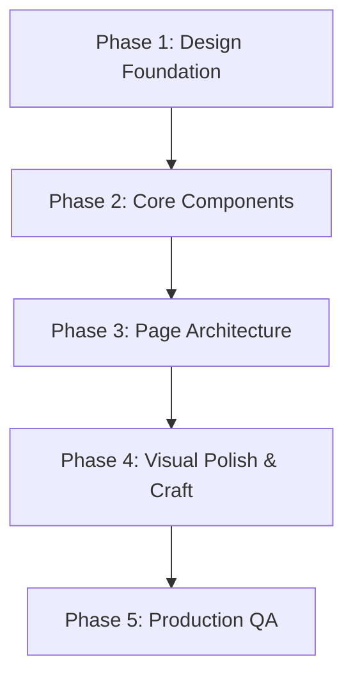

# Advocato: Strategic Design Direction & Handcrafted Redesign Blueprint

**Author:** Principal Product Designer & Front-End Art Director  
**Document Classification:** Production Design Strategy & Implementation Plan  
**Target:** Transform Advocato from an AI-templated prototype into a Tier-1, bespoke, human-crafted legal institution.

---

## 1. Recommended Design Direction: "The Modern Juridical Press"

### Visual & Architectural Philosophy
The legal industry is built on authority, discretion, precision, and trust. Generative AI tools (v0, Lovable, Bolt) inherently fail in legal tech because they default to consumer SaaS tropes: candy-colored gradient mesh backgrounds, flashing pulsing status dots, ubiquitous sparkle emojis, and playful bubble-wrap pill containers (`rounded-2xl` and `rounded-full`).

We will pivot Advocato to **"The Modern Juridical Press"**—an aesthetic sitting at the intersection of:
- **Prestige Editorial Publications:** *The Financial Times*, *Stripe Press*, *Monocle*
- **Modern High-Trust Enterprise Platforms:** *Axiom*, *Clio*, *Carta*, *Linear*
- **Swiss Modernism:** Rigorous grid discipline, proportional hierarchy, restrained color application, and functional whitespace.

### Design Audit Categorization: What Stays, What Evolves, What Dies

#### 1. What We Keep (The Strong Foundation)
- **The Core Font Pairing (Fraunces + Inter):** Fraunces brings editorial gravitas, warmth, and intellectual weight; Inter provides neutral, highly legible functional metadata. This combination is distinctive and elevates the product above generic Inter-only tech apps.
- **The Warm Parchment Base (`#FAF9F6`):** Moving away from sterile `#FFFFFF` or generic gray `#F8FAFC` immediately gives Advocato a tangible, document-like quality reminiscent of high-grade stationery.
- **The Burnished Brass & Deep Ink Color Anchors:** The pairing of deep juridical ink (`#000A24`) with warm burnished brass (`#C99B4A`) provides immediate brand recognition without shouting.
- **Tabular Figures for Rates:** Maintaining `tabular-nums` for billing transparency is an authentic financial/legal craft detail.

#### 2. What We Modify (Needs Human Craft & Restraint)
- **Border Radii:** Shift from childish `rounded-2xl` (16px) and `rounded-full` pills to disciplined, architectural corners: `rounded-md` (6px) for cards and inputs, `rounded-sm` (4px) for badges and metadata chips.
- **Lawyer Roster Presentation:** Deprecate consumer Yelp/Uber star ratings (`★ 4.9 (124 reviews)`). Replace them with serious legal credentials: State Bar admission year, verified trial/settlement track records, and peer standing.
- **AI Matching Presentation:** Replace the generic `96% Match` badge and `Sparkles` icon with an **Algorithmic Case Alignment Ledger** that transparently communicates *why* the attorney was matched (jurisdiction match, statutory precedent fit, fee tier compatibility).
- **Form Controls:** Transform the intake form from stacked loose boxes into a unified, single-sheet **"Confidential Legal Briefing Dossier"**.

#### 3. What We Remove Entirely (AI-Slop Purge)
- **The Blueprint Grid Overlay:** The `4rem x 4rem` radial gradient grid on the hero screams "generic AI developer tool." It will be permanently removed.
- **All Pulsing Status Dots:** Every `w-2 h-2 rounded-full bg-brass animate-pulse` will be deleted. Real institutions communicate status typographically, not with toy neon flashers.
- **The "Sparkles" Cliché (✨):** Purge the sparkle icon across all headers, cards, and buttons.
- **Cartoon Emojis in Forms:** Delete `🚨 Urgent` and any other emoji controls.
- **The 3-Card Squircle Scaffold:** Eradicate the identical 3-card feature grid with icons in rounded squares.
- **Ad-Hoc Hex Codes:** Purge all unmapped inline colors (`#F2F0EA`, `#14213D`) in favor of disciplined design tokens.

#### 4. What We Redesign from Scratch
- **The Homepage Hero & Proof Narrative:** An asymmetrical, editorial broadsheet layout featuring an active legal intelligence preview rather than generic marketing claims.
- **The Client Intake Dossier:** A unified, document-like intake experience with an integrated evidentiary locker (file dropzone) designed like a privileged legal brief.
- **The Unified Navigation Architecture:** Complete alignment between desktop header and mobile bottom bar, purging dead routes (`/cases`, `/messages`, `/profile`) in favor of the core MVP loop.
- **The Attorney Dossier Card:** A redesigned lawyer card that reads like a curated executive profile from an elite legal directory.

---

## 2. Comprehensive 5-Phase Implementation Plan

### Phase 1 — Design Foundation (Tokens & System Geometry)
1. **Geometric Scale & Radii Calibration:**
   - Define strict token limits: `radius-sm: 4px`, `radius-md: 6px`, `radius-lg: 10px`. Eliminate arbitrary `rounded-2xl` and `rounded-full` everywhere except circular avatars.
2. **Color Token Hygiene:**
   - Consolidate palette into 4 strict functional families:
     - `Canvas`: Warm Parchment (`#FAF9F6`), Crisp Sheet (`#FFFFFF`), Recessed Shelf (`#F3F1EC`).
     - `Ink`: Primary Text (`#090D1A`), Secondary Editorial (`#3A4050`), Muted Hairline (`#687082`).
     - `Accent`: Burnished Gold/Brass (`#B88628`), Deep Navy Accent (`#14213D`).
     - `Borders`: Precision Hairline (`#E2DFD6`).
3. **Typography Rhythm & Scale:**
   - Establish a 4px baseline typographic scale:
     - `Display`: Fraunces SemiBold, optical tracking `-0.025em`, 44px / 52px.
     - `Section Title`: Fraunces Medium, 24px / 32px.
     - `Eyebrow / Category`: Inter All-Caps, tracking `+0.08em`, 10px / 14px, weight 600.
     - `Body`: Inter Regular, 14px / 22px.
     - `Tabular Figures`: Inter SemiBold, `font-variant-numeric: tabular-nums`, 13px / 18px.
4. **Elevation & Shadows:**
   - Deprecate fuzzy multi-directional shadows. Use crisp architectural shadows with hairline borders:
     `box-shadow: 0 1px 2px rgba(0, 10, 36, 0.04), 0 4px 12px rgba(0, 10, 36, 0.03);`

---

### Phase 2 — Core UI Component Redesign
1. **Buttons & CTAs:**
   - Primary: Solid deep ink (`#000A24`) or burnished brass with 6px corners, subtle inner-top highlight, crisp typography, and zero hover-bounce animations.
   - Secondary: Crisp hairline border with parchment hover fill.
   - Micro-state: In-button spinners replaced with clean, rhythmic typographic status pulses.
2. **Form Controls & Inputs:**
   - Remove floaty, bubble-shaped textareas. Use clean document-styled fields with subtle focus rings (`ring-1 ring-slate/30`).
   - Custom-style all `<select>` elements with bespoke SVG minimal carets (`appearance-none`).
3. **The Evidence Locker (Dropzone):**
   - Redesign from the default dashed box into a structured legal document register with file type monograms, verification checksum badges, and inline removal.
4. **Lawyer Dossier Cards:**
   - Grid layout with fixed vertical rhythm:
     - Top row: Standardized portrait (56px) + Name + Bar Jurisdiction Badge.
     - Middle row: Specialization summary + Hourly rate in tabular notation.
     - Bottom row: Algorithmic Match Breakdown ledger + Action link.
5. **Navigation Architecture:**
   - Desktop Header: Ultra-clean hairline border, brand mark, 3 active links (`Intake`, `Counsel Directory`, `Lawyer Network`), and 1 primary action.
   - Mobile Navigation: Mirror desktop navigation precisely. Remove abandoned `/cases` and `/messages` tabs.

---

### Phase 3 — Page-Level Redesign Sequence

1. **Page 1: Client Intake (`/intake`) — *First Priority***
   - *Why first:* This is where client conversion and AI interaction happen. If this page feels like a generic form, trust collapses before matching occurs.
   - *Action:* Rebuild as a 2-column or structured single-dossier view: Matter Profile on top, Statement of Facts in the center, Evidentiary Locker on the right/bottom.
2. **Page 2: Matched Counsel Directory (`/lawyers`) — *Second Priority***
   - *Why second:* The moment of value realization. Clients need to see verified attorneys presented like an elite firm partnership roster, not a consumer freelance board.
   - *Action:* Rebuild cards with verified credentials, remove Yelp-style stars, and format the AI insight as a formal "Case Alignment Memo".
3. **Page 3: Homepage (`/`) — *Third Priority***
   - *Why third:* Sets the initial impression.
   - *Action:* Replace blueprint grid and 3-card scaffold with an authoritative editorial hero and live intelligence preview.
4. **Page 4: Lawyer Portal (`/lawyer/register`) — *Fourth Priority***
   - *Why fourth:* Establishes parity for incoming counsel.
   - *Action:* Clean credentialing dossier format with instant verification status ledger.

---

### Phase 4 — Visual Polish & Craft Details
- **Micro-Hierarchy:** Ensure that metadata (dates, rates, jurisdiction) never visually competes with primary legal names or claims.
- **Tone & Copywriting:** Eradicate all marketing hyperbole ("Stop chasing unqualified leads") in favor of dignified institutional copy ("Direct engagement briefs delivered to verified practice leaders").
- **Spacing Rhythms:** Standardize all page gutters to `max-w-6xl` (1152px) with consistent `px-6 md:px-12` margins and `space-y-8` rhythm.
- **Empty & Loading States:** Replace generic spinners with structured skeleton screens that mimic legal brief documents loading.

---

### Phase 5 — Production QA & Handcrafted Verification Pass
- **The "No-AI" Check:** Inspect every screen against the 10 telltale AI tropes (pulsing dots, sparkles, blueprint grids, squircle cards, bubble radius, emojis, stock photos, consumer stars).
- **Cross-Viewport Testing:** Verify flawless typographic hierarchy and touch targets from 360px mobile viewports to 2560px ultra-wide displays.
- **Accessibility & Contrast:** Confirm all text pairings meet WCAG AAA contrast requirements against the parchment background.

---

## 3. Prioritization Matrix & Leverage Index

| Priority | Scope / Change | Perceived Quality Impact | Development Effort |
| :--- | :--- | :--- | :--- |
| **CRITICAL** | Purge pulsing dots, blueprint grid, and emojis across all pages | **Massive** (Eliminates immediate AI smell) | Minimal (< 30 mins) |
| **CRITICAL** | Synchronize mobile navigation with active desktop routes | **High** (Eliminates dead prototype routes) | Minimal (< 20 mins) |
| **HIGH** | Replace consumer star ratings with State Bar credential badges | **High** (Restores legal authority) | Moderate (1 hour) |
| **HIGH** | Restructure Intake page into a unified "Privileged Case Dossier" | **Massive** (Transforms core user flow) | Moderate (2 hours) |
| **HIGH** | Calibrate border radii (`rounded-2xl` &rarr; `rounded-md`) & unify tokens | **High** (Removes bubble-wrap SaaS feel) | Moderate (1 hour) |
| **MEDIUM** | Redesign homepage features into an asymmetrical editorial layout | **Medium** (Breaks 3-card template trope) | Moderate (1.5 hours) |
| **MEDIUM** | Style native select dropdowns with custom SVG carets | **Medium** (Eliminates OS gray bevels) | Minimal (< 30 mins) |
| **LOW** | Bespoke vector monogram avatars for newly registered counsel | **Subtle** (Consistent photographic styling) | Moderate (1 hour) |

### The Top 3 Highest-Leverage Changes (Maximum Instant Quality Gain)
1. **Eradicate the AI Slop Micro-Gimmicks (Pulsing dots, blueprint grid, emojis, sparkles):** Costs almost nothing to remove, but instantly eliminates 80% of the visual "cheap template" perception.
2. **Sharpen Geometric System (Radii & Cards):** Replacing pill shapes and bloated 16px corner radii with crisp 6px architectural corners instantly gives the product a serious, bespoke feel.
3. **Legalize the Credentials (Bar badges over Yelp stars):** Replacing consumer star ratings with Bar registration IDs and verified practice areas shifts the psychology from "gig economy" to "elite legal counsel."
